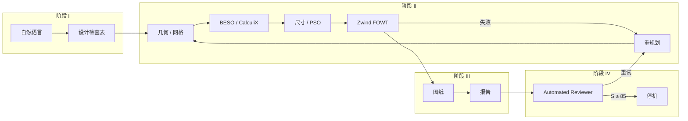
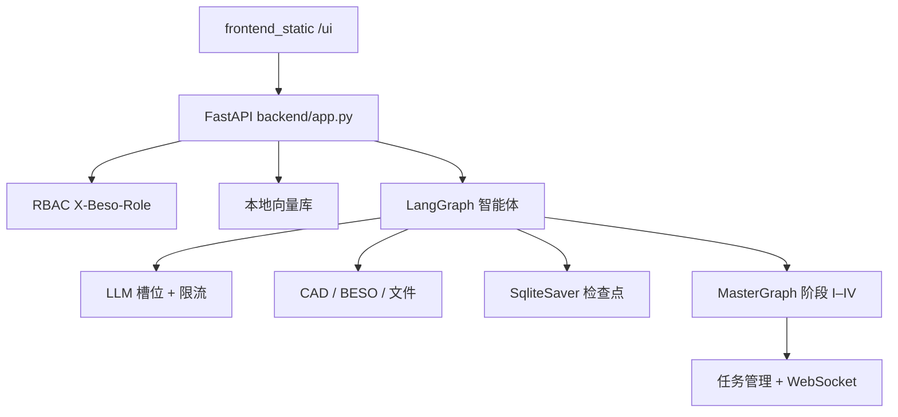

# The AI Engineer（人工智能工程师）

论文伴生代码：**「Closed-loop AI achieves certifiable engineering design」**。

[](README.md)
[](README-ch.md)
[](backend/requirements.txt)
[](LICENSE)

---

**The AI Engineer** 将大语言模型与确定性工程后端（几何/网格、拓扑优化、尺寸优化、多物理场校核）组成**验证闭环**。仅当内部 **Automated Reviewer** 判定候选方案达到可认证就绪时停止探索；船级社 AIP 用作外部校准，而非每次运行的目标函数。

> 预印本 / 稿件伴生仓库。沉积包见 [`submission/zenodo_bundle/`](submission/zenodo_bundle/)。Zenodo 上传后请替换 `DOI_PLACEHOLDER`。

---

## 人类工程师 vs AI Engineer

闭环设计对齐专业流程：需求 → 设计基础 → 优化 → 图纸/报告 → 评审，各阶段的 **logs / metrics / retry** 回馈至 LLM 编排器（Qwen + AI Engineer）。


---

## 端到端工作流（九步产物）

从自然语言需求，经 OC4 参考几何、设计域/非设计域、BESO 拓扑、尺寸升尺度与优化、CAD 出图，到 AI 评审报告。


| 步骤 | 示意产物 |
|------|----------|
| 1 需求 | `01_User_Requirements.md` |
| 2 编排 | `02_AI_Orchestrator_Workflow.yaml` |
| 3 OC4 参考 | `03_OC4_Reference_Model.step` |
| 4 设计域 | `04_Design_Space_Definition.step` |
| 5 拓扑优化 | `05_Topology_Optimization_Result.vtk` |
| 6 升尺度 | `06_Dimension_Upscaling_Rules.json` |
| 7 尺寸优化 | `07_Dimension_Optimized_Model.tcl` |
| 8 图纸 | `08_CAD_Drawing.dwg` |
| 9 AI 评审 | `09_AI_Review_Report.pdf` |

---

## 阶段模型

| 阶段 | 职责 |
|------|------|
| **I — 需求** | 将业主意图、场址约束与规范条款解析为结构化任务描述 |
| **II — 闭环设计** | FreeCAD → 网格 → CalculiX–BESO → 参数升尺度 → PSO 尺寸优化 → Zwind；失败时自主重规划 |
| **III — 交付物** | 工程图与结构化设计报告 |
| **IV — 内部门禁** | Automated Reviewer；当综合分 **S ≥ 85**（A 级）且分项均 ≥ 60 时停机 |



---

## 运行时架构（LangGraph）



核心目录：`backend/llm/`（配置、并发、流式、特性开关）、`backend/agents/`、`backend/graph/pipeline/`、`backend/security/`（RBAC）、`backend/rag/`（向量索引）。

---

## 工程化能力

### 智能体并发

| 控制项 | 环境变量 | 默认 | 含义 |
|--------|----------|------|------|
| LLM 槽位 | `LLM_MAX_CONCURRENT` | 8 | 全局异步 LLM 调用信号量 |
| 智能体扇出 | `AGENT_MAX_CONCURRENT` | 4 | 并行子图 / 批任务（`gather_limited`、`map_agent_jobs`） |
| 每分钟限流 | `LLM_REQUESTS_PER_MIN` | 0（关闭） | 滑动窗口 RPM |
| 工具线程池 | `LLM_TOOL_POOL_WORKERS` | 4 | 阻塞型 CAD/求解器工具 |

```python
from backend.llm.concurrency import with_llm_slot, gather_limited, map_agent_jobs

await with_llm_slot(lambda: llm.ainvoke(...))
results = await gather_limited([lambda: run_case(c) for c in cases], limit=4)
```

### 角色与权限（RBAC）

本地/开发环境基于请求头；`BESO_AUTH_ENABLED=true` 开启严格模式。

| 角色 | 典型权限 |
|------|----------|
| `viewer` | 读任务、检索 RAG |
| `engineer` | 写任务、跑 LLM、管理/检索 RAG |
| `orchestrator` | + 跑流水线 |
| `admin` | 全部 |

```http
X-Beso-Role: engineer
X-Beso-User: alice
GET /api/security/me
GET /api/security/roles
```

路由守卫：`Depends(require_permissions(Permission.RUN_PIPELINE))`。

### 向量数据库（RAG）

零额外依赖的 **哈希嵌入** + JSONL 索引，默认目录 `WORKSPACE_ROOT/.beso_rag`（可用 `BESO_VECTOR_DIR` 覆盖）。

```http
POST /api/rag/upsert   {"texts": ["..."], "metadatas": [{"source": "DNV"}]}
POST /api/rag/search   {"query": "疲劳极限状态", "top_k": 5}
GET  /api/rag/stats
```

需要更强语义时，替换 `embed_fn`（OpenAI / sentence-transformers）即可，存储 API 不变。

---

## 仓库结构

```
backend/           FastAPI、任务、WebSocket、LangGraph、RBAC、RAG、评审与工具
frontend_static/   浏览器 UI（/ui/）
beso/              CalculiX 环路 BESO 核心
graph/             工作流 / 依赖图资源
scripts/           可复现辅助脚本
tests/             单元与 API 测试
docs/assets/       README 配图
third_party/       text-to-cad、Zwind 等
deploy/            可选部署说明
```

本地产物（`runs/`）、临时文件、IDE 目录、`.env`、`.beso_rag/` **不纳入**公开发布树。

---

## 环境要求

- **OS**：以 Windows 为主；Linux/macOS 可用于纯 API 路径
- **Python**：3.10+（推荐 3.11/3.12）
- **CalculiX**（`ccx`）：`CCX_PATH`
- **FreeCADCmd**：`FREECAD_CMD`
- **可选**：Node.js（CAD Explorer）、LLM 密钥、`third_party/zwind_newmodel/`

依赖锁定见 [`backend/requirements.txt`](backend/requirements.txt)。

---

## 快速开始

```powershell
python -m venv .\.venv
.\.venv\Scripts\python -m pip install -U pip
.\.venv\Scripts\python -m pip install -r .\backend\requirements.txt

$env:PYTHONPATH = (Get-Location).Path
# 可选: $env:QWEN_API_KEY = "..."
.\.venv\Scripts\python -m uvicorn backend.app:app --host 127.0.0.1 --port 8000
```

- UI：http://127.0.0.1:8000/ui/
- 健康检查：`GET /health`
- OpenAPI：`/docs`

将 [`.env.example`](.env.example) 复制为 `.env`。**切勿提交 API 密钥。**

### 常用环境变量

| 变量 | 用途 |
|------|------|
| `WORKSPACE_ROOT` | 沙箱根目录 |
| `CCX_PATH` / `FREECAD_CMD` | 求解器 |
| `QWEN_API_KEY` / `QWEN_BASE_URL` / `QWEN_MODEL` | LLM |
| `LLM_MAX_CONCURRENT` / `AGENT_MAX_CONCURRENT` | 并发 |
| `BESO_AUTH_ENABLED` / `BESO_DEFAULT_ROLE` | RBAC |
| `BESO_VECTOR_DIR` | RAG 索引路径 |
| `USE_LANGGRAPH_*` / `USE_LEGACY_LLM` | 图编排开关 / 旧路径回退 |
| `LANGSMITH_API_KEY` | 可选链路追踪 |

---

## 可复现说明

在相同输入下求解器后端确定性；LLM 编排可能随采样变化。请锁定工具 schema 与依赖版本，并按稿件 Methods 进行多种子实验。第三方求解器保留各自许可证。

## 引用

见 [`CITATION.cff`](CITATION.cff)。

> Yu, T. et al. Closed-loop AI achieves certifiable engineering design. *(Nature Article submission / arXiv preprint)*.

通讯作者：王立林 — `lilin.wang@zju.edu.cn`  
Zenodo DOI：**DOI_PLACEHOLDER**

## Nature 投稿材料

[`submission/`](submission/) — 稿件、SI、投稿信、Zenodo 布局（运行应用非必需）。

## 许可与专利

MIT（[`LICENSE`](LICENSE)），不含第三方求解器与合作方保密数据。商业使用可能受专利申请约束。

## 安全

勿提交密钥；若密钥曾出现在日志或截图中请立即轮换。
