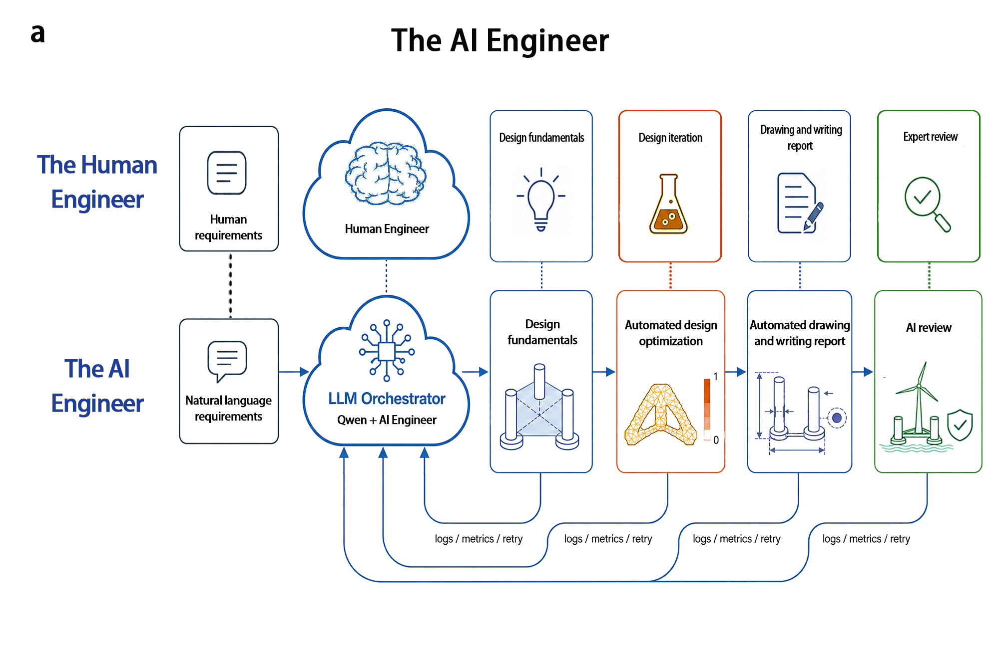
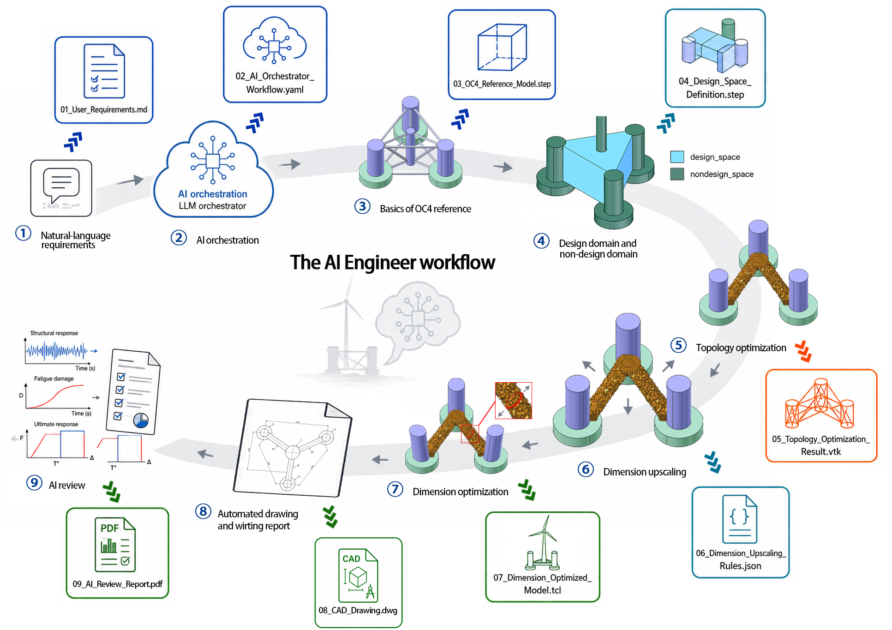
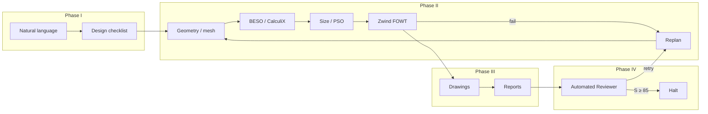
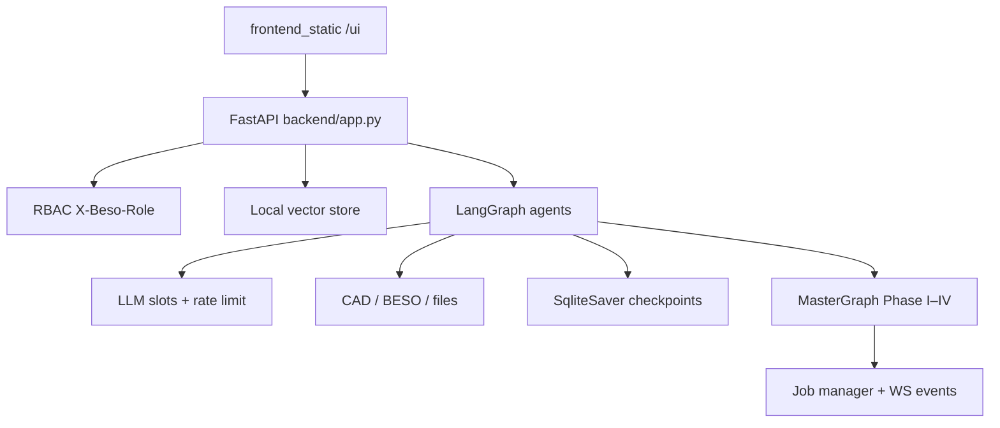

# The AI Engineer

Companion code for the manuscript **"Closed-loop AI achieves certifiable engineering design"**.

[](README.md)
[](README-ch.md)
[](backend/requirements.txt)
[](LICENSE)

---

**The AI Engineer** is an agentic orchestration stack that couples large language models with deterministic engineering backends (geometry, mesh, topology optimization, size optimization, multi-physics verification) in a **verification-closed loop**. Exploration stops only when an internal **Automated Reviewer** judges a candidate certification-ready; formal Approval in Principle (AIP) is used as external calibration, not as the per-run objective.

> Preprint / manuscript companion. Deposition package: [`submission/zenodo_bundle/`](submission/zenodo_bundle/). Replace `DOI_PLACEHOLDER` after Zenodo upload.

---

## Human engineer vs AI Engineer

Closed-loop design mirrors a professional workflow: requirements → fundamentals → optimization → drawings/report → review, with **logs / metrics / retry** feeding back into the LLM orchestrator (Qwen + AI Engineer).



---

## End-to-end workflow (nine artifacts)

From natural-language requirements through OC4 reference geometry, design/non-design space, BESO topology, dimension upscaling & optimization, CAD drawings, to AI review reports.



| Step | Artifact (illustrative) |
|------|-------------------------|
| 1 Requirements | `01_User_Requirements.md` |
| 2 Orchestration | `02_AI_Orchestrator_Workflow.yaml` |
| 3 OC4 reference | `03_OC4_Reference_Model.step` |
| 4 Design domain | `04_Design_Space_Definition.step` |
| 5 Topology opt. | `05_Topology_Optimization_Result.vtk` |
| 6 Upscaling | `06_Dimension_Upscaling_Rules.json` |
| 7 Size opt. | `07_Dimension_Optimized_Model.tcl` |
| 8 Drawings | `08_CAD_Drawing.dwg` |
| 9 AI review | `09_AI_Review_Report.pdf` |

---

## Phase model

| Phase | Role |
|------|------|
| **I — Requirements** | Parse owner intent, site constraints, and classification provisions into a structured job descriptor |
| **II — Closed-loop design** | FreeCAD → mesh → CalculiX–BESO → parametric upscaling → PSO size opt. → Zwind evaluation; autonomous replan on failures |
| **III — Deliverables** | Engineering drawings and structured design reports |
| **IV — Internal gate** | Automated Reviewer; halt when composite score **S ≥ 85** (grade A) and no sub-score below 60 |



---

## Runtime architecture (LangGraph)



Key packages: `backend/llm/` (config, concurrency, streaming, flags), `backend/agents/` (assistant / design-domain / structured), `backend/graph/pipeline/` (MasterGraph), `backend/security/` (RBAC), `backend/rag/` (vector index).

---

## Engineering platform features

### Agent concurrency

| Control | Env | Default | Meaning |
|---------|-----|---------|---------|
| LLM slots | `LLM_MAX_CONCURRENT` | 8 | Global async LLM call semaphore |
| Agent fan-out | `AGENT_MAX_CONCURRENT` | 4 | Parallel subgraph / batch jobs (`gather_limited`, `map_agent_jobs`) |
| RPM | `LLM_REQUESTS_PER_MIN` | 0 (off) | Sliding-window rate limit |
| Tool pool | `LLM_TOOL_POOL_WORKERS` | 4 | Thread pool for blocking CAD/solver tools |

```python
from backend.llm.concurrency import with_llm_slot, gather_limited, map_agent_jobs

await with_llm_slot(lambda: llm.ainvoke(...))
results = await gather_limited([lambda: run_case(c) for c in cases], limit=4)
```

### Role & permission management (RBAC)

Header-based actors for local/dev; enable hard mode with `BESO_AUTH_ENABLED=true`.

| Role | Typical permissions |
|------|---------------------|
| `viewer` | read jobs, search RAG |
| `engineer` | write jobs, run LLM, manage/search RAG |
| `orchestrator` | + run pipeline |
| `admin` | all |

```http
X-Beso-Role: engineer
X-Beso-User: alice
GET /api/security/me
GET /api/security/roles
```

Wire route guards with `Depends(require_permissions(Permission.RUN_PIPELINE))`.

### Vector database (RAG)

Dependency-free **hashing embedder** + JSONL index under `WORKSPACE_ROOT/.beso_rag` (override with `BESO_VECTOR_DIR`).

```http
POST /api/rag/upsert   {"texts": ["..."], "metadatas": [{"source": "DNV"}]}
POST /api/rag/search   {"query": "fatigue limit state", "top_k": 5}
GET  /api/rag/stats
```

Swap `embed_fn` for OpenAI / sentence-transformers when you need denser embeddings; keep the same store API.

---

## Repository layout

```
backend/           FastAPI, jobs, WebSocket, LangGraph LLM layer, RBAC, RAG,
                   Automated Reviewer, OC4 services, tools
frontend_static/   Browser UI (/ui/)
beso/              BESO core for CalculiX loop
graph/             Workflow / dependency graph assets
scripts/           Reproducibility helpers
tests/             Unit and API tests
docs/assets/       README figures (workflow diagrams)
third_party/       CAD utilities (text-to-cad), Zwind bundle
deploy/            Optional deployment notes
```

Local outputs (`runs/`), scratch extracts, IDE folders, `.env`, and `.beso_rag/` are **not** published.

---

## Requirements

- **OS**: Windows primary; Linux/macOS OK for API-only paths
- **Python**: 3.10+ (3.11/3.12 recommended)
- **CalculiX** (`ccx`): `CCX_PATH`
- **FreeCADCmd**: `FREECAD_CMD`
- **Optional**: Node.js (CAD Explorer); LLM API key; Zwind under `third_party/zwind_newmodel/`

Pinned packages: [`backend/requirements.txt`](backend/requirements.txt).

---

## Quick start

```powershell
python -m venv .\.venv
.\.venv\Scripts\python -m pip install -U pip
.\.venv\Scripts\python -m pip install -r .\backend\requirements.txt

$env:PYTHONPATH = (Get-Location).Path
# Optional: $env:QWEN_API_KEY = "..."
.\.venv\Scripts\python -m uvicorn backend.app:app --host 127.0.0.1 --port 8000
```

- UI: http://127.0.0.1:8000/ui/
- Health: `GET /health`
- OpenAPI: `/docs`

Copy [`.env.example`](.env.example) → `.env`. **Never commit API keys.**

### Environment variables (selected)

| Variable | Purpose |
|----------|---------|
| `WORKSPACE_ROOT` | Sandbox root |
| `CCX_PATH` / `FREECAD_CMD` | Solvers |
| `QWEN_API_KEY` / `QWEN_BASE_URL` / `QWEN_MODEL` | LLM |
| `LLM_MAX_CONCURRENT` / `AGENT_MAX_CONCURRENT` | Concurrency |
| `BESO_AUTH_ENABLED` / `BESO_DEFAULT_ROLE` | RBAC |
| `BESO_VECTOR_DIR` | RAG index path |
| `USE_LANGGRAPH_*` / `USE_LEGACY_LLM` | Graph rollout / legacy opt-in |
| `LANGSMITH_API_KEY` | Optional tracing |

---

## Reproducibility

Solver backends are deterministic given identical inputs; LLM orchestration may vary with sampling. Pin schemas and dependencies; use multi-seed campaigns as in the manuscript Methods. Third-party solvers keep their own licenses.

## Citation

See [`CITATION.cff`](CITATION.cff).

> Yu, T. et al. Closed-loop AI achieves certifiable engineering design. *(Nature Article submission / arXiv preprint)*.

Corresponding author: Lilin Wang — `lilin.wang@zju.edu.cn`  
Zenodo DOI: **DOI_PLACEHOLDER**

## Nature submission package

[`submission/`](submission/) — manuscript draft, SI, cover letter, Zenodo layout (not required to run the app).

## License and patents

MIT ([`LICENSE`](LICENSE)), excluding third-party solvers and partner-confidential data. Patent applications may apply to commercial use.

## Security

Do not commit secrets. Rotate any key exposed in logs or screenshots.
